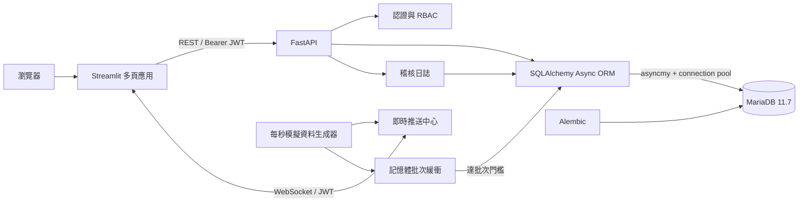

# 系統架構與資料流程

## 即時資料生命週期

1. FastAPI lifespan 啟動單一非同步模擬器，每秒產生數值、分類與時間戳。
2. 事件立即送往已驗證 JWT 的 WebSocket 用戶端，前端保留最近 60 筆繪圖。
3. 同一事件加入記憶體緩衝；達到 `BATCH_SIZE` 後，以 SQLAlchemy ORM 單一 transaction 批次寫入 MariaDB。
4. 寫入暫時失敗時保留批次並在下一週期重試；應用關閉時也會嘗試寫入未滿批次資料。
5. 歷史資料可由 REST API 分頁、篩選、排序、聚合，或匯出為 Excel。

## 權限邊界

| 角色 | 能力 |
| --- | --- |
| Viewer | 即時監控、查詢、分析、Excel 下載 |
| User | Viewer 能力，加上新增、匯入及管理自己建立的資料 |
| Admin | 所有資料管理、使用者角色、稽核日誌與資料庫狀態 |

所有資料庫存取均透過 SQLAlchemy ORM / Expression API，應用程式沒有原生 SQL。容器只在內部 Compose 網路連接 MariaDB；對外公開 FastAPI 與 Streamlit 連接埠。
